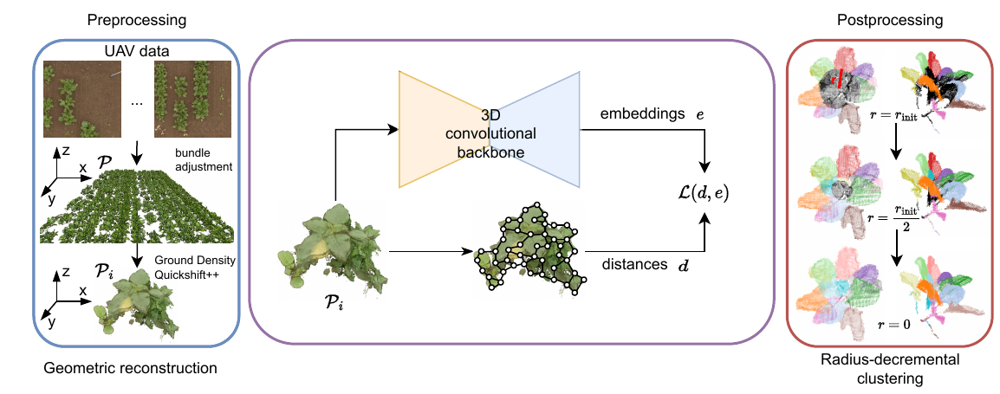

# Unsupervised-Pre-Training-for-3D-Leaf-Instance-Segmentation

Official repository of [Unsupervised Pre-Training for 3D Leaf Instance Segmentation](https://ieeexplore.ieee.org/document/10265122?source=authoralert) by Roggiolani et al.

## Overview 

Our approach train the backbone of a neural network to learn per-point embeddings to be fine-tuned for the task of 3D leaf instance segmentation. 

We use domain specific augmentations, simulating leaf occlusions and wind distortion. We also compute a graph over the down-sampled point cloud, which enforces points closer together and belonging to the same leaf to have a similar embedding. 

We also propose a new post-processing approach for embedding based 3D instances, ad hoc for our task, which boosts the performance in all the investigated scenarios.



## Get Started

This package contains a pybinded module and, as it is, requires Minkowski Engine for the backbone. If you use any other framework for 3D convolutons, feel free to change the backbone and the dataloading to be compatible with your architecture. 

Define your parameters in the configuration file and start the training with
```
python train.py 
```

## Weights

| Embedding Size      |  Distances on Graph |  Link |
| ----------- | ----------- | -------- |
| 3  |  No | [g3e.ckpt](https://www.ipb.uni-bonn.de/html/projects/roggiolani2023ral/g3_1e.ckpt) |
| 3  | Yes |  [g3c.ckpt](https://www.ipb.uni-bonn.de/html/projects/roggiolani2023ral/g3_1c.ckpt)  |
| 24 | Yes |  [g24.ckpt](https://www.ipb.uni-bonn.de/html/projects/roggiolani2023ral/g24.ckpt) |
| 48 | Yes |  [g48.ckpt](https://www.ipb.uni-bonn.de/html/projects/roggiolani2023ral/g48.ckpt) |

## Citation 

```bibtex
@article{roggiolani2023ral,
author = {G. Roggiolani and F. Magistri and T. Guadagnino and J. Behley and C. Stachniss},
title = {{Unsupervised Pre-Training for 3D Leaf Instance Segmentation}},
journal = ral,
year = {2023},
volume = {8},
issue = {11},
pages = {7448-7455},
doi = {10.1109/LRA.2023.3320018},
issn = {2377-3766},
}
```
